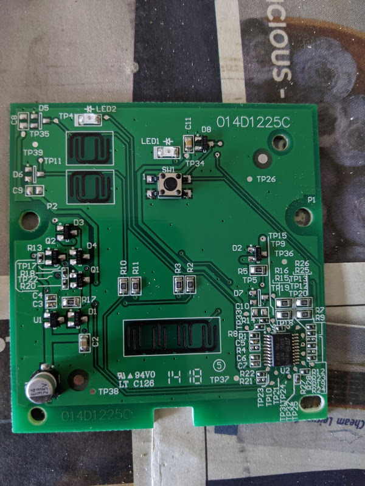
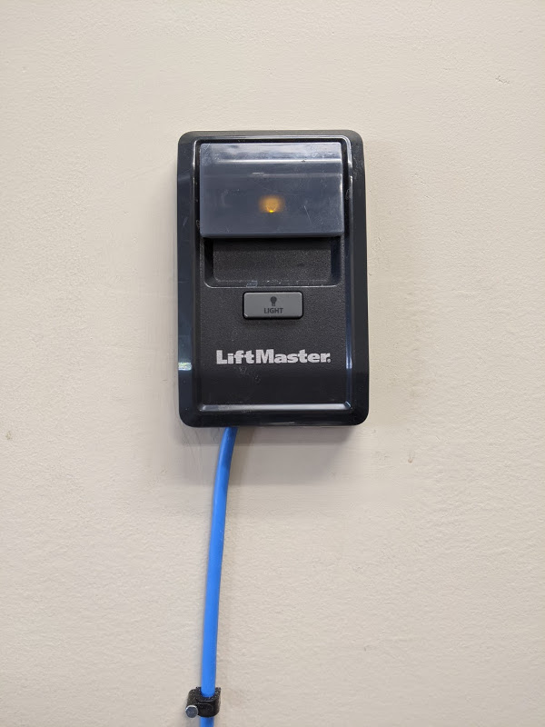
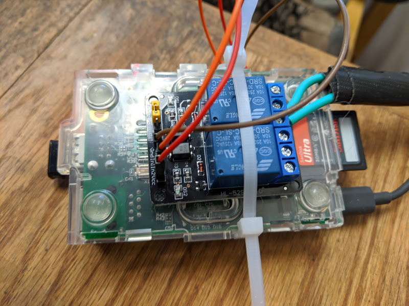
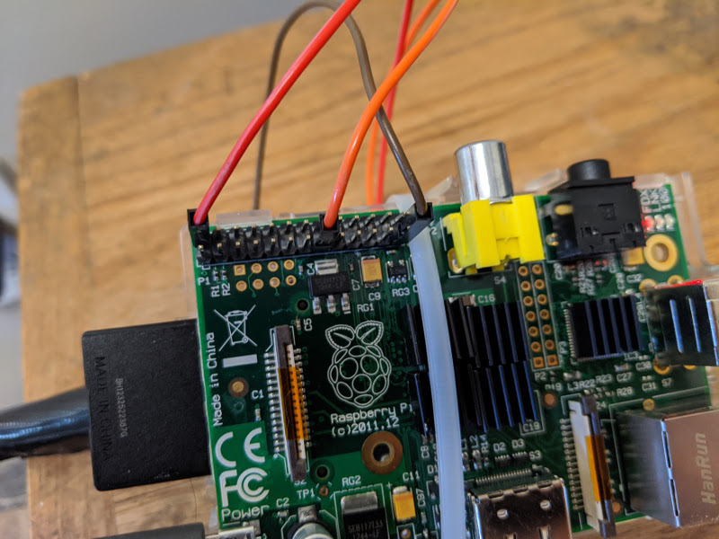

# Relay controller to open and close my garage door

Our house came with a couple of garage door openers. They're bulky though so we would like to open and close our garage door with our phones. The garage door brand is Liftmaster and it actually supports myQ, Liftmaster's proprietary home automation platform. I played around with it and soon realized you need their 828LM internet gateway to connect the garage door opener to their myQ cloud. I'm trying to not use proprietary home automation clouds if possible.

The wall controller is a 882LM and it has a simple push button switch with 12V going in.



If the garage door is triggered by a simple momentary switch, then that's where I can hook into from the outside. I soldered two wires to the right side pins of `SW1` similar to [here](https://www.wagex.org/?p=127) (I forgot to take a picture of that). I was uncertain whether I could wire this switch up to the Raspberry Pi directly. At first I thought about following what that person did but then I saw that they're using a WiFi switch that requires a particular app. I'd like to integrate it with my home automation system. I got a "2 Channel DC 5V Relay Module with Optocoupler Low Level Trigger". and connected C and NC with the wires coming from the switch. The relay is then triggered by the Raspberry Pi.





A simple REST API which runs as a `systemd` service brings it together and is used to integrate it with the home automation system. I use [Home Assistant](https://www.home-assistant.io/) and a REST API can be integrated like this (`configuration.yaml`)

```
rest_command:
  toggle_garage_door:
    url: 'http://raspberrypi-that-hosts-the-api.local:5000/garage/trigger'
    method: 'post'

script:
  toggle_garage_door:
    sequence:
      - service: rest_command.toggle_garage_door
```

## Prerequisites

Requires `virtualenv`

## Install dependencies

```
mkvirtualenv relay-garage-controller
pip install -r requirements.txt
```

## Start application

```
gunicorn -w 2 -b 0.0.0.0:5000 garage_controller:app
```

## Install as linux service

```
./scripts/build.sh && sudo ./scripts/install.sh
```

## Control garage door

`curl -X POST http://localhost:5000/garage/trigger`
